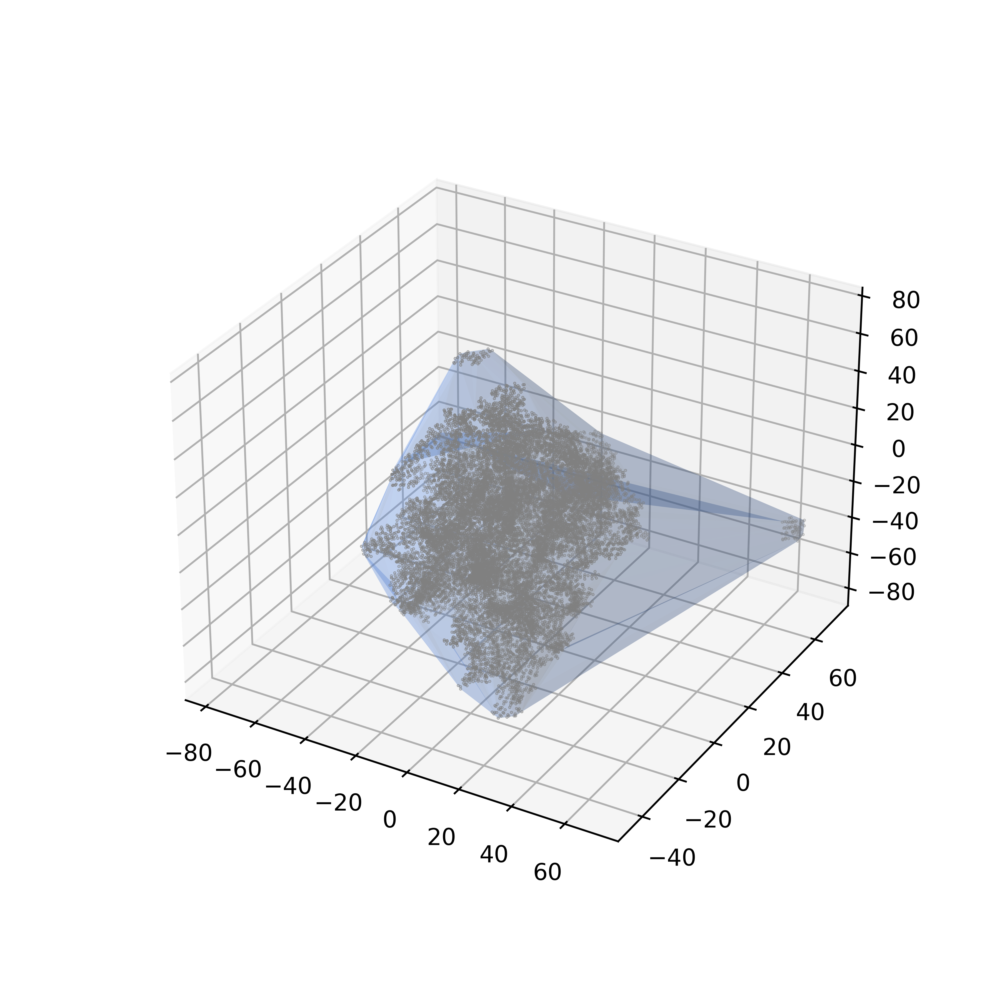
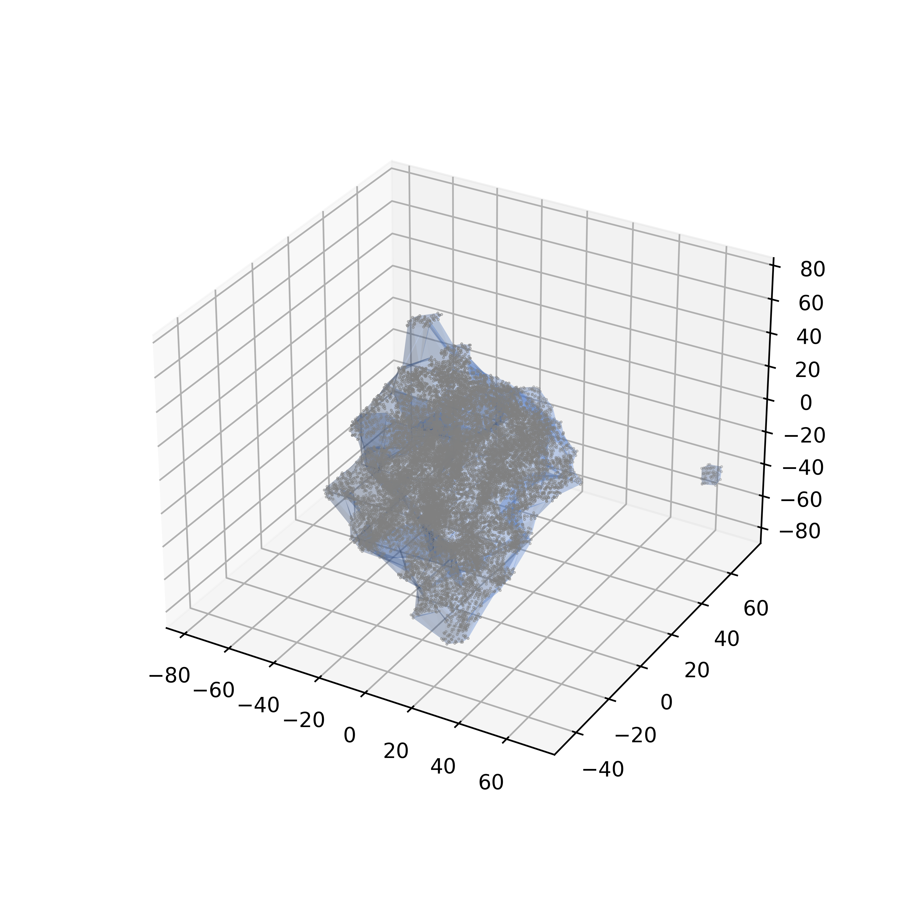
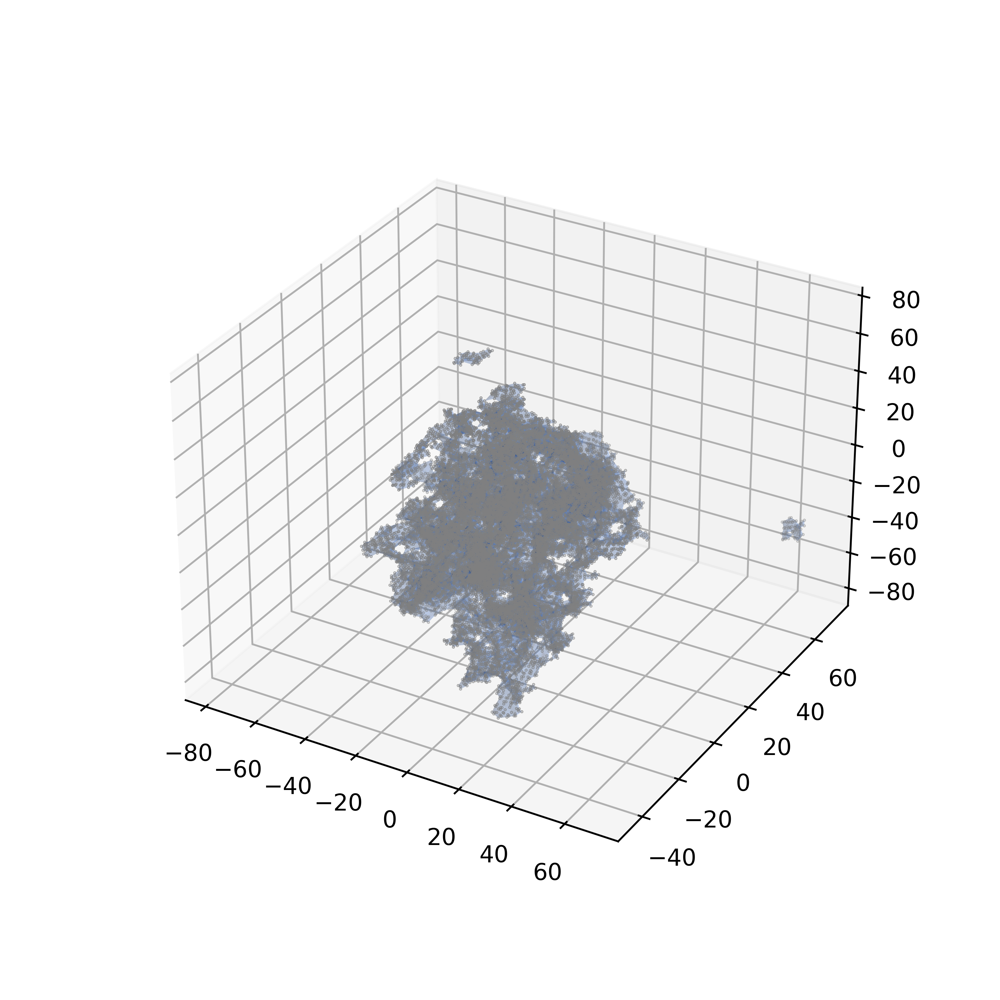
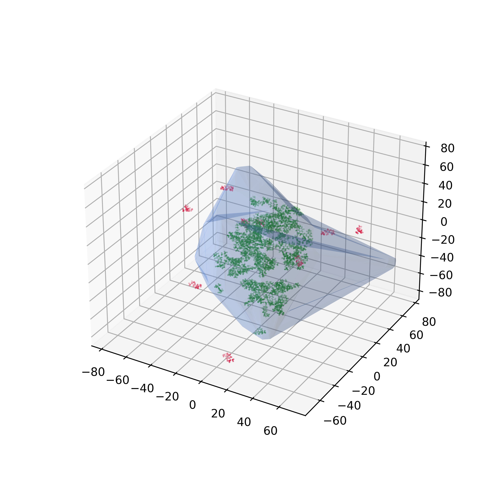
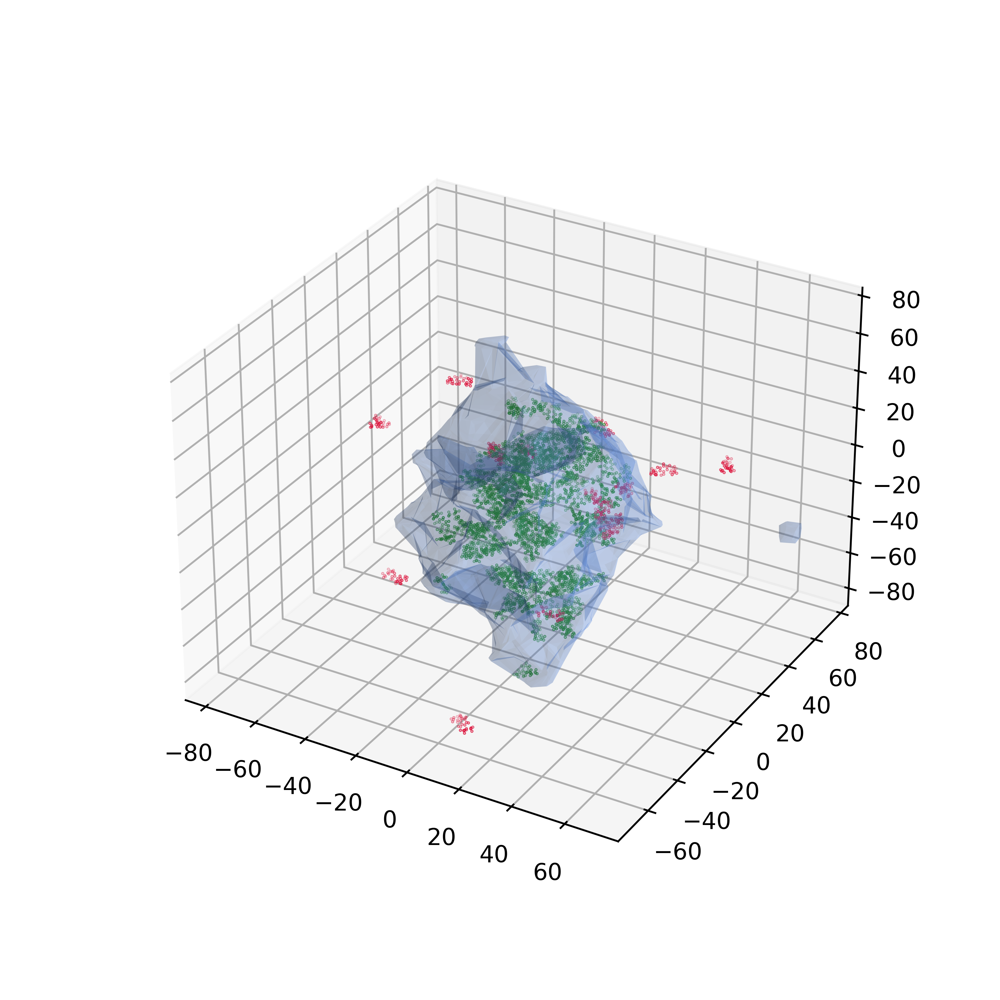
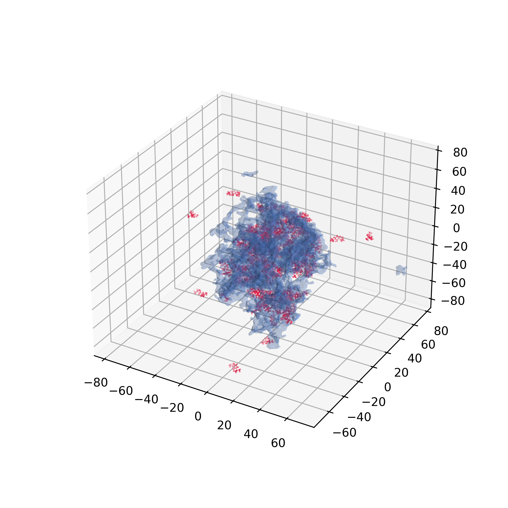
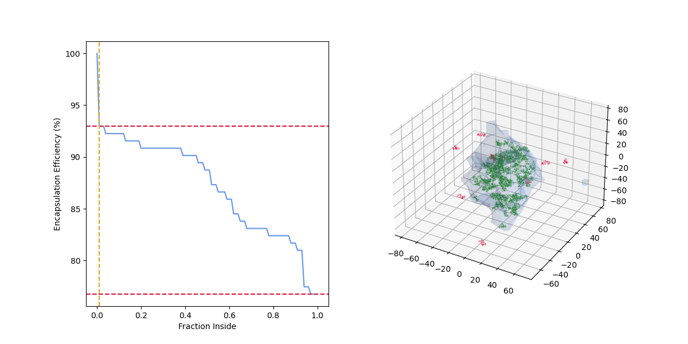

# Alphashape Loading

Calculate drug loading based on an MD simulation.

An alphashape is first calculated for the nanoparticle, then the fraction of each drug molecule inside the nanoparticle is calculated.

The loading curve is then calculated by varying the fraction of the drug molecule that must be inside the nanoparticle to be considered encapsulated.

The loading curve is saved as a csv and a plot.

## Inputs
- Sample name (used for saving the output files)
- Data path (folder containing the data, with the polymer data in one file and each drug molecule in separate files)
- Alpha parameter for the alphashape calculation
- Boolean to save a gif of the fraction inside changing (default is False to save time)

Effect of the alpha parameter on the alphashape calculation:
| alpha=0.01 | alpha=0.1 | alpha=0.5 |
|:----------:|:---------:|:-------:|
| Loose fitting | Medium fitting | Tight fitting |
|  |  |  |
|  |  |  |

## Outputs
- A csv file containing the loading curve
- A plot of the loading curve
- A gif of the fraction inside changing (if requested)

As the "fraction inside" increases, the number of drug molecules considered encapsulated (green) decreases, the number of drug molecules considered outside (red) increases, and the encapsulation efficiency decreases.

## References
[Aphashape package](https://github.com/bellockk/alphashape) - More information on the package used to calculate the alphashape.

[Alphashape Wikipedia](https://en.wikipedia.org/wiki/Alpha_shape) - More information on alphashapes in general.